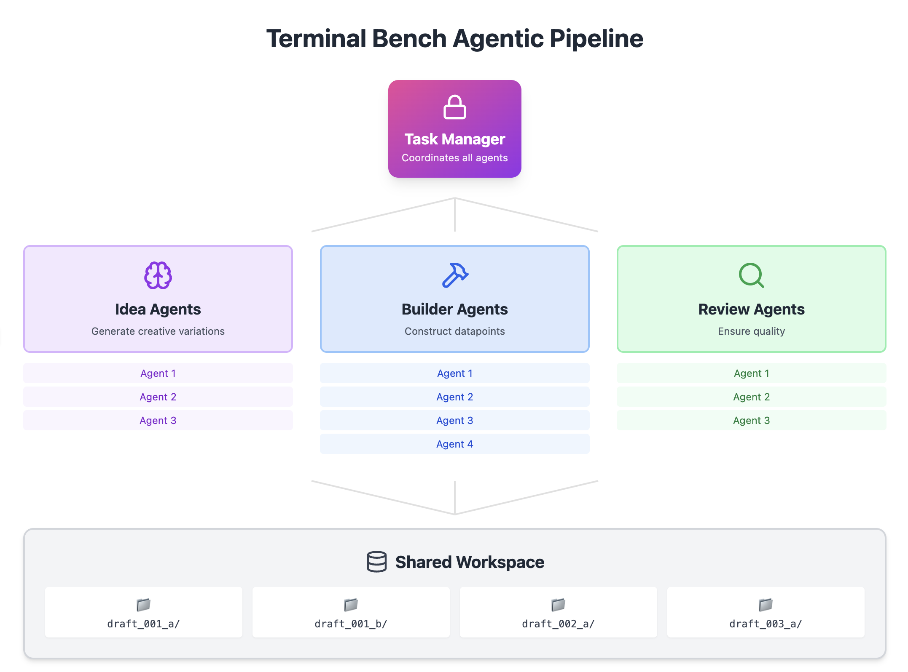

# 🤖 Terminal Bench Agentic Data Pipeline

**TL;DR:** I built a multi-agent system with 20+ Claude Code instances working in parallel to generate high-quality training data for terminal-based coding tasks, producing 331+ validated datapoints for my [scalable RL training project](https://github.com/Danau5tin/terminal-bench-rl).

**Why build an agentic data pipeline?**

Because generating quality training data for coding agents requires creativity, validation, and scale—tasks perfectly suited for AI collaboration.

## 🎬 See It In Action

Watch 20+ agents working in parallel to generate training data at scale:
# TODO: Add here




---

## 📚 Table of Contents

- [See It In Action](#-see-it-in-action)
- [High-Level Architecture](#-high-level-architecture)
- [Pipeline Results](#-pipeline-results)
- [Agent Roles & Workflow](#-agent-roles--workflow)
  - [Idea Generation Agents](#-idea-generation-agents)
  - [Datapoint Builder Agents](#-datapoint-builder-agents)
  - [Quality Review Agents](#-quality-review-agents)
- [Task Manager System](#-task-manager-system)
- [Datapoint Structure](#-datapoint-structure)
- [Validation Pipeline](#-validation-pipeline)
- [Infrastructure & Tools](#-infrastructure--tools)
- [Getting Started](#-getting-started)
- [Key Design Decisions](#-key-design-decisions)

---

## 🏗️ High-Level Architecture

The pipeline transforms Terminal Bench evaluation tasks into diverse training datapoints through three specialized agent stages:

1. **Seed tasks** from Terminal Bench → **Idea Agents** → Creative variations
2. **Draft ideas** → **Builder Agents** → Complete executable datapoints  
3. **Built datapoints** → **Review Agents** → Production-ready training data

All agents work independently in parallel, coordinated by a central Task Manager that prevents duplication and handles failures.

---

## 📈 Pipeline Results

### Production Output
- **331 validated datapoints** generated
- **20+ agents** working concurrently
- **3 specialized agent types** with distinct roles
- **100% Docker-validated** environments

### Datapoint Categories Generated

| Category | Count | Description |
|----------|-------|-------------|
| Software Engineering | 97 | API development, CLI tools, code architecture |
| System Administration | 59 | Server config, process management, monitoring |
| Security | 42 | Vulnerability fixes, authentication, encryption |
| Data Processing | 37 | ETL pipelines, data parsing, transformations |
| Debugging | 28 | Fix race conditions, memory leaks, logic errors |
| Machine Learning | 17 | Model training, data preprocessing, evaluation |
| File Operations | 15 | File parsing, I/O optimization, format conversion |
| Scientific Computing | 15 | Numerical methods, simulations, data analysis |

### Most Common Technologies
- **Python**: Used in 196 datapoints (59%)
- **CLI Tools**: 47 datapoints
- **APIs**: 30 datapoints
- **C**: 22 datapoints

---

## 🔄 Agent Roles & Workflow

Each agent type operates independently with specialized tools and clear responsibilities:

### 🎨 Idea Generation Agents
- **Input**: Seed tasks from Terminal Bench
- **Process**: Analyze core skills → Generate n×multiplier variations → Select best ideas
- **Output**: Draft specifications in shared workspace

**Key Innovation**: Refinement criteria provided only AFTER brainstorming to maximize creativity

### 🔨 Datapoint Builder Agents  
- **Input**: Draft specifications from idea agents
- **Process**: Build complete scenarios → Validate via software script → Iterate until passing
- **Output**: Executable datapoints with all required components

**Validation Requirements**:
- ✅ Dockerfile builds successfully
- ✅ Tests fail before agent intervention
- ✅ All dependencies present
- ✅ Test weights sum to 1.0

### 🔍 Quality Review Agents
- **Input**: Validated datapoints from builders
- **Process**: Check quality standards → Edit if needed → Re-validate → Categorize
- **Output**: Approved datapoints with metadata or rejection with reasons

---

## 📊 Task Manager System

The Task Manager enables parallel agent coordination without complex handoffs:

```python
# Agent claims work atomically
task = tm.get_next_task("idea-agent-07", task_types=["generate_idea"])

# Process independently
draft_ideas = generate_creative_variations(task["seed_data"])

# Complete with results
tm.complete_task(task["id"], "idea-agent-07", {"drafts": draft_ideas})
```

**Features**:
- Atomic task claiming (no collisions)
- Automatic timeout recovery
- Parent-child task tracking
- Real-time status monitoring

---

## 📁 Datapoint Structure

Each training datapoint contains:

```
draft_001_a/
├── prompt.md       # 1-3 sentence task (e.g., "Auth times out with 100+ users. Fix it.")
├── dockerfile      # Ubuntu 24.04 (or similar) environment setup
├── tests.py        # Pytest verification functions
├── weights.json    # Test importance distribution
└── files/          # Additional resources
    ├── app.py      # Broken code to fix
    └── config.json # Configuration files
```

---

## ✅ Validation Pipeline

Shared validation tools ensure quality across all agents:

1. **Docker Build**: Environment must build successfully
2. **Test Discovery**: Pytest must find all test functions
3. **Fail-First**: Tests must fail in initial state
4. **Dependency Check**: All required packages present
5. **Weight Validation**: Test weights sum to exactly 1.0

---

## 🛠️ Infrastructure & Tools

### Workspace Organization
```
agents/
├── idea_agent_workspace/      # Idea generation tools & instructions
├── dp_builder_workspace/      # Building tools & staging areas
└── review_agent_workspace/    # Review tools & quality checks

shared_workspace/              # Common filesystem for all agents
shared_tools/                  # Validation, patching, utilities
task_manager/                  # Coordination & state management
```

### Agent-Specific Tools
- **Idea Agents**: `get_task_parameters.py`, `get_idea_refinement_details.py`
- **Builder Agents**: `create_dp.py`, `add_dp_to_review.py`
- **Review Agents**: `approve_datapoint.py`, `cancel_datapoint.py`, `show_categories_tags.py`

### Shared Tools
- `validate_datapoint.py` - Complete validation suite
- `patch_dp.py` - Update datapoint components
- `patch_additional_files.py` - Manage resource files

---

## 🚀 Getting Started

```bash
# Clone repository
git clone https://github.com/Danau5tin/tbench-agentic-data-pipeline.git
cd tbench-agentic-data-pipeline

# Install dependencies
uv sync

# Initialize seed tasks
python init_seed_tasks.py <path_to_terminal_bench_tasks>

# Launch agents with Claude Code
# Idea Agent:
"See @agents/idea_agent_workspace/workflow_instructions.md - you are the idea generation agent, go!"

# Builder Agent:
"See @agents/dp_builder_workspace/workflow_instructions.md - you are the datapoint builder agent, go!"

# Review Agent:
"See @agents/review_agent_workspace/workflow_instructions.md - you are the quality review agent, go!"
```

---

## 💡 Key Design Decisions

### Why Multiple Agent Types?
- **Separation of concerns**: Each agent excels at one task
- **Parallel scaling**: Multiple instances per type
- **Quality gates**: Three-stage validation ensures high standards

### Why Shared Filesystem?
- **Simplicity**: No complex message passing
- **Reliability**: File operations are atomic
- **Debugging**: Easy to inspect intermediate states

### Why Task Manager?
- **Coordination**: Prevents duplicate work
- **Recovery**: Handles agent failures gracefully
- **Monitoring**: Real-time pipeline visibility

---

**Built with Claude Code** 🤖 - This entire multi-agent system was developed using Claude Code, demonstrating the power of AI agents building infrastructure for other AI agents.